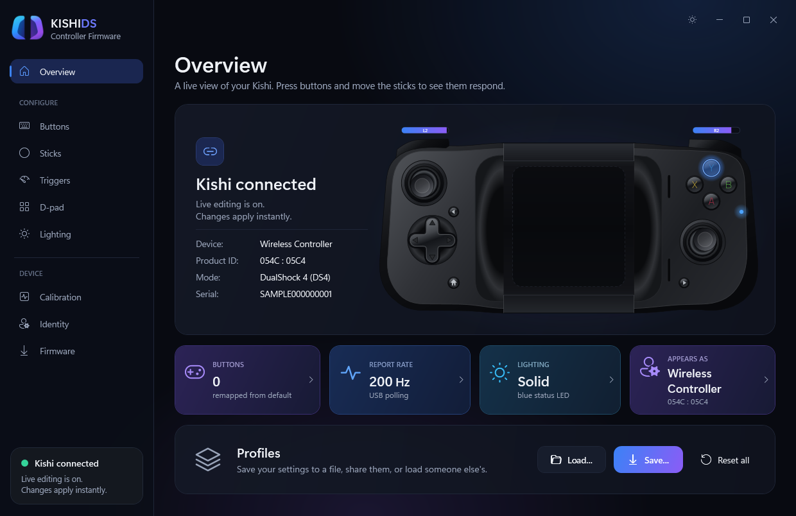
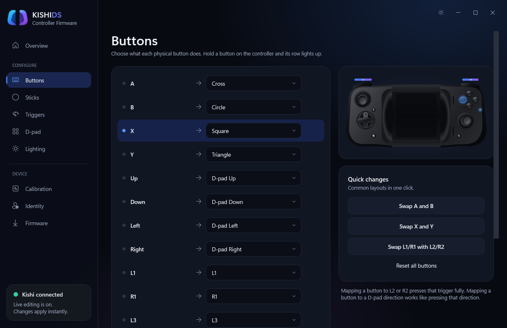
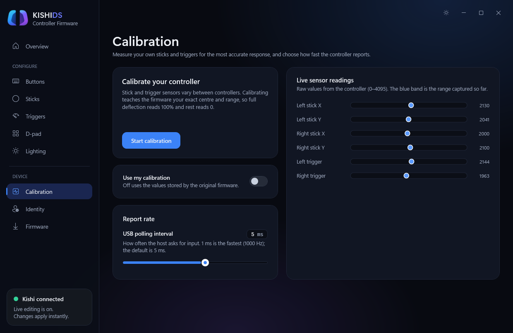
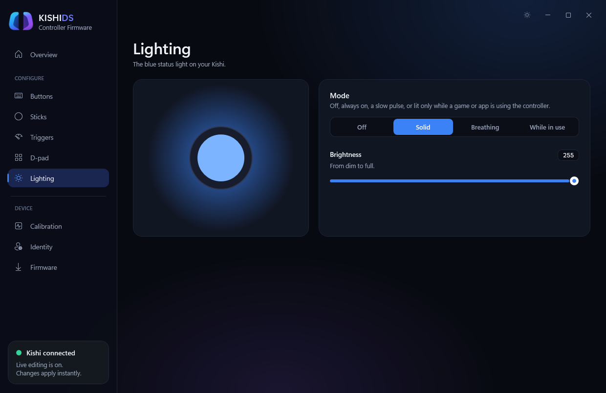
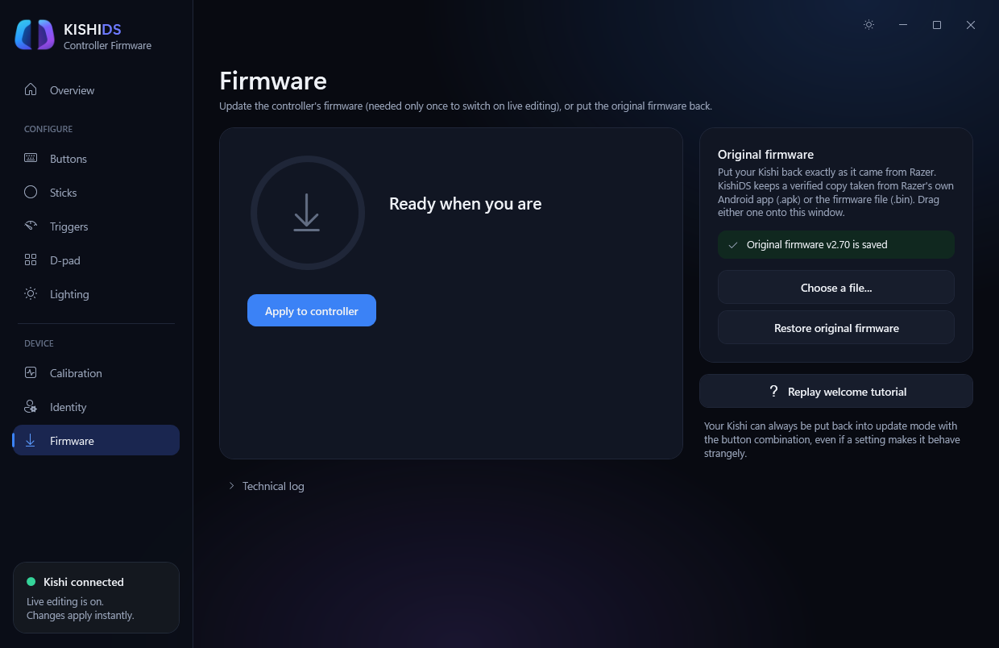

# 📱 **Android APK coming very soon!**

# KishiDS

**Kishi DualShock**: custom firmware that makes the **Razer Kishi V1 (RZ06-0290)** show up as a wired **DualShock 4**, plus a Windows app to
configure it live over USB and flash it.

> **Unofficial, use at your own risk.** Not affiliated with, endorsed by, or sponsored by Razer or Sony. "Razer", "Kishi" and "DualShock" are
> trademarks of their owners, used here only to describe compatibility. The firmware identifies itself with a DualShock 4's USB IDs on purpose so
> hosts treat it as a standard gamepad; it is not a Sony product. Flashing replaces the controller's firmware. Developed and tested on one unit.
> The controller's own bootloader is never modified, so you can always return to update mode and restore Razer's firmware.

## What it does

- Presents the Kishi as a DualShock 4 (`054C:05C4`) and reports all of its controls: sticks, triggers, D-pad, face and shoulder buttons, L3/R3, and the
  function and home buttons.
- Live settings over USB, saved to the controller: button remapping and quick swaps, stick deadzone, response curve, inversion and stick swap,
  trigger response, click threshold and digital-trigger mode, D-pad behaviour, sensor calibration, the blue status LED (off, solid, breathing, while in use,
  with brightness and pulse length), device name, and USB report rate.
- Keeps the controller's own serial number (the one on its sticker). The USB IDs and manufacturer string (`ElectroTamp KishiDS`) are locked so a
  profile can't produce an invalid identity.
- Flashes through the Kishi's vendor bootloader (USB DFU) and can restore Razer's original firmware.
- Save, load and share profiles as files.

| Buttons | Calibration |
|---|---|
|  |  |
| **Lighting** | **Firmware** |
|  |  |

## Use it

1. Install the [.NET 9 Desktop Runtime](https://dotnet.microsoft.com/download/dotnet/9.0) (Windows 64-bit; tested on Windows 11).
2. Get `KishiDS.exe` from the [Releases](../../releases) page (or build it: [docs/BUILDING.md](docs/BUILDING.md)). Check it against the SHA-256 in the release notes.
3. Run it. A setup guide walks through saving Razer's original firmware (so you can always go back) and switching the controller.
4. **First flash only:** the Kishi's bootloader needs the WinUSB driver once. See [Flash a controller](docs/BUILDING.md#5-flash-a-controller).
   To enter update mode: unplug the Kishi, hold **Y + B + Right Function**, plug it in while holding.

After that, every setting changes live while the controller is connected.

### Getting back to stock

Razer's firmware is **not included** in this repository (it is Razer's copyright). KishiDS can read it from Razer's own Android app
(Razer Kishi 1.0.34 or 1.0.66 `.apk`) or from a raw 28,108-byte `.bin`, verifies it by SHA-256
(`AA915363C858E5A06FB1AD15A82D059D50FD22A625D0663A3CE99FCAB24F69BE`), and keeps it for **Restore original firmware**. The button combination above works
whatever firmware is installed, so a bad flash of the application can always be recovered from.

## Repository layout

| Path | What it is |
|---|---|
| `KishiDS/` | The .NET 9 WPF app (no NuGet packages). |
| `firmware-research/ds4-firmware/` | The controller firmware (C, libopencm3), host tests, and the prebuilt `kishi_ds4.bin`. |
| `firmware-research/tools/` | Python helpers. `gen_config.py` is the single source of the settings schema shared by firmware and app. |
| `firmware-research/*.md` | Reverse-engineering notes: [board and pin map](firmware-research/BOARD_MAP.md), firmware map, input map, DS4 target, feasibility, [bring-up history](firmware-research/BRINGUP_HISTORY.md). |
| `firmware-research/third_party/libopencm3` | Git submodule, pinned. |
| `docs/` | [Building](docs/BUILDING.md), [engineering notes](docs/ENGINEERING_NOTES.md), screenshots. |
| `art/`, `SVG/` | Logo and controller artwork used by the app. |

## What is not in the repository

Razer's APKs, its stock firmware images and their decompiled sources are left out on purpose (Razer's copyright). If you keep your own stock backup,
`firmware-research/device-backups/` is git-ignored for it, along with other local-only files (see `.gitignore`).

## Third-party components

- [libopencm3](https://github.com/libopencm3/libopencm3) (LGPL-3.0), linked into the firmware; included as a submodule.
- [dfu-util](https://dfu-util.sourceforge.net/) and libusb (GPL-2.0 / LGPL-2.1), bundled as `firmware-research/tools/dfu-util/dfu-util-static.exe` and run as a
  separate program. Build notes: `firmware-research/tools/dfu-util/README.txt`; license text: `firmware-research/tools/dfu-util/COPYING`.
- The DualShock 4 report descriptor data comes from the Android CTS capture linked in the firmware README.

## License

No license has been chosen yet, so all rights are reserved by default: you can read the code, but you don't have permission to reuse it until a license is added.
